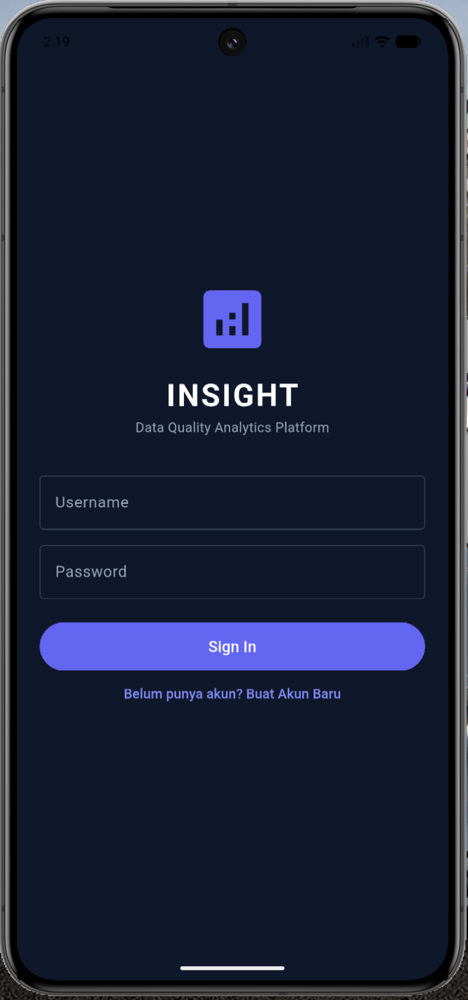
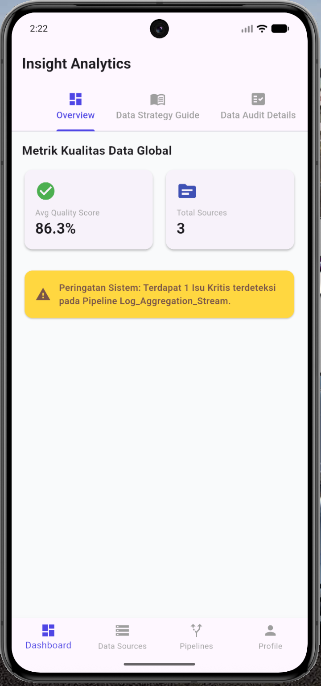
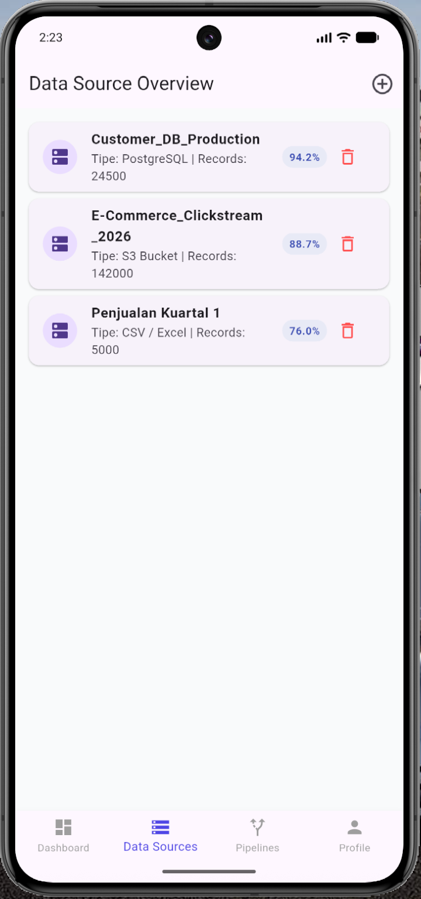
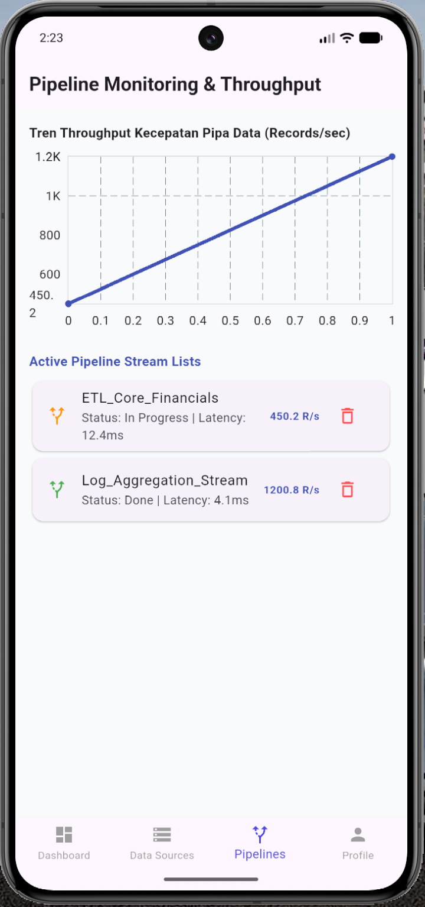

# 📊 Insight App - Data Quality Analytics Platform

[](https://flutter.dev)
[](https://developer.android.com)
[](https://developer.android.com)

**Insight App** adalah aplikasi mobile berbasis Flutter yang dirancang untuk melakukan manajemen, monitoring, dan analisis kualitas data secara komprehensif. Aplikasi ini merupakan transformasi dari versi web platform *Data Governance* ke dalam arsitektur aplikasi mobile modern yang interaktif, modular, dan terintegrasi dengan penyimpanan lokal permanen.

Proyek ini disusun untuk memenuhi tugas praktikum mata kuliah **Pemrograman Mobile**, Fakultas Teknologi Industri, Universitas Trisakti.

---

## Screenshots & Antarmuka Aplikasi

Di bawah ini adalah representasi visual dari antarmuka aplikasi Insight App versi Flutter:

| Halaman Autentikasi | Dashboard Analytics | Data Source (Wizard) | Pipeline & Tracking |
| :---: | :---: | :---: | :---: |
|  |  |  |  |

---

## Fitur Utama Platform

1. **Multi-Tab Dashboard Overview**: 
   * **Overview Metrics**: Memantau skor kualitas data rata-rata (*Average Quality Score*) dan total aset data secara dinamis.
   * **Data Strategy Guide**: Artikel panduan komprehensif mengenai tata kelola data (*Data Governance*) dan perencanaan strategi data enterprise.
   * **Data Audit Details**: Tabel parameter parameter standar audit operasional (*Completeness, Accuracy, Validity, Consistency, Timeliness*).
2. **Data Source Management & 4-Step Wizard**:
   * Panduan *step-by-step* interaktif untuk mendaftarkan aset data baru.
   * Terintegrasi dengan sistem **File Picker lokal** untuk memilih berkas dokumen asli (CSV, JSON, PDF, Gambar).
3. **Paralel Pipeline Monitoring**:
   * Otomatis mengantrekan proses pipa data baru setiap kali data source berhasil didaftarkan.
   * Pilihan status pipa data dinamis (*To Do, In Progress, In Review, Done*).
   * Visualisasi grafik tren performa *Throughput* menggunakan diagram garis interaktif (**FL Chart**).
4. **Local Database & CRUD Cleanup**:
   * Mekanisme hapus data (*Delete progress tracking*) untuk membersihkan baris record SQLite kapan saja.
5. **Advanced User Profile & Camera Input**:
   * Fitur pengambilan gambar profil langsung lewat kamera fisik atau galeri device.
   * Kompresi resolusi citra biner otomatis sebelum diarsip ke lokal database.

---

## Implementasi Konsep Pemrograman Mobile (Android)

Aplikasi ini mengimplementasikan poin-poin fundamental modul praktikum mobile secara ketat:

* **Layout & UI**: Menggunakan struktur hierarki widget deklaratif (`Scaffold`, `AppBar`, `Column`, `Row`, `Container`, `Center`). Memanfaatkan widget `Stack` untuk menumpuk ikon kamera di atas avatar profile, serta unit *logical pixels* dan `SafeArea` agar tampilan responsif.
* **Android Form & Validation**: Menggunakan widget `Form` dan `TextFormField` yang terikat dengan `GlobalKey<FormState>` untuk mengelola aturan penanganan serta validasi input *user* (seperti pada menu Sign In, Register, dan Wizard).
* **Android MVVM Architecture**: Pemisahan tanggung jawab kode secara modular menjadi 3 layer utama:
  * **Model**: Struktur cetak biru data objek (`user_model`, `data_source_model`, `pipeline_model`).
  * **ViewModel**: Logika bisnis aplikasi dan state manajemen menggunakan paket **Provider** dengan mekanisme notifikasi `notifyListeners()`.
  * **View**: Representasi UI murni yang merespons perubahan data dari ViewModel secara *real-time*.
* **Rest API Integration**: Melakukan *fetching* asynchronous data wilayah administrasi luar menggunakan paket `http` via request `http.get()` dan konversi `jsonDecode()`.
* **Android Storage (Persistence Storage)**: Memanfaatkan database relasional lokal **SQLite** melalui paket `sqflite` untuk menyimpan data transaksi sesi, data source, dan pipeline secara permanen (*offline-first*), lengkap dengan penyemaian data awal (*mock seed data*).
* **Upload File & Kompresi Base64**: Menjelajahi berkas asli media penyimpanan internal lewat `file_picker`. Gambar dari kamera dikompresi kualitas biner ukurannya lewat paket `image`, kemudian dikonversi menjadi representasi teks berbasis string **Base64** agar bisa disimpan rapi di kolom teks SQLite.

---

## Dependensi & Library Utama

Daftar pustaka yang digunakan dalam berkas `pubspec.yaml`:
* `provider` - State management arsitektur MVVM.
* `sqflite` & `path` - Operasi persistence database SQLite lokal.
* `file_picker` - Akses penjelajah dokumen asli lokal.
* `image_picker` - Akses kamera fisik dan galeri media smartphone.
* `image` - Proses resizing dan kompresi citra JPEG/PNG.
* `fl_chart` - Komponen visualisasi diagram grafik garis monitoring.
* `http` - Komunikasi data REST API eksternal.

---

## Cara Menjalankan Aplikasi di Lokal

### Prasyarat Sistem
* Flutter SDK (Min. versi 3.x)
* Android Studio / Xcode
* **Java Development Kit (JDK 11 atau JDK 17 ARM64)** -> *Wajib untuk mendukung Gradle compile task terbaru pada macOS Apple Silicon*.

### Langkah Instalasi
1. Clone repositori ini ke komputer lokal lu:
   ```bash
   git clone [https://github.com/giovanialfareza/insight-app.git](https://github.com/giovanialfareza/insight-app.git)
   cd insight-app
